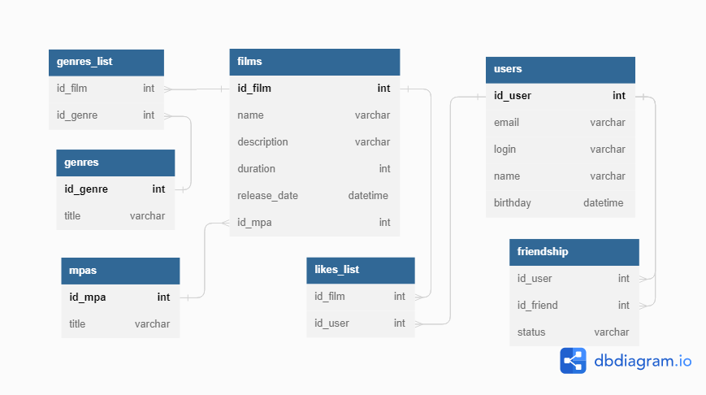

# java-filmorate
Template repository for Filmorate project.

## ER-diagram  


Ссылка на ER-diagram на ресурсе dbdiagram.io:
https://dbdiagram.io/d/643d3c9f6b31947051b9144e

В таблице films находятся сущности фильмов, у которых id является PK. Таблица films связана с таблицей
mpas через ключ id_mpa. Таблица genres_list является сводной между таблицами films (ключ id_film) и genres(ключ 
id_genres).

Таблица likes_list состоит из id фильмов и id пользователей, которые поставили лайки этим фильмам.
У данной таблицы связь с friends один ко многим где связующий ключ id_film. Связь с таблицей users
также один ко многим, ключ id_user.

Таблица users содержит сущности пользователей с PK id_user. У таблицы users связь с таблицей
friendship(таблица с парами друзей) по PK, который в таблице friendship может быть как id_user
так и id_friend (зависит от условий).

Запросы были проверены в https://www.db-fiddle.com/ с параметром DataBase: MySQL 5.7
### Примеры запросов по логике работы с фильмами:

**Добавить фильм (addFilm):**
```sql
INSERT into films (title,description,duration,release_date)
VALUES ('title1', 'description1', 1, '1111-01-01');
```
**Найти всё фильмы(findAllFilms):**
```sql
SELECT * FROM films;
```
**Найти фильм по id(findFilm):**
```sql
SELECT * FROM films
WHERE id = 1;
```
**Изменение фильма(updateFilm):**
```sql
UPDATE films SET title = 'title1_up', description = 'update1', duration = 11,
release_date = '1111-11-11' WHERE id = 1;
```
**Добавить like фильму (addLike):**
```sql
INSERT INTO likes_list (id_film, id_user)
VALUES(1,1);
```
**Находим лучшую десятку фильмов(findTop):**
```sql
SELECT id, title, description, duration, release_date
FROM films AS f
LEFT JOIN likes_list AS ll ON f.id = ll.id_film
GROUP BY id, title, description, duration, release_date
ORDER BY COUNT(id_user) desc;
```
**Удаляем like(deleteLike):**
```sql
DELETE FROM likes_list WHERE id_user = 1;
```
### Примеры запросов по логике работы с пользователями:  
**Добавить пользователя (addUser):**
```sql
INSERT INTO users (name,email,login,birthday)
Values ('User1', 'user1@test.com', 'loginUser1', '1111-01-01');
```
**Внести изменения данных пользователя (updateUser):**
```sql
UPDATE users SET name = 'upUser1', email = 'upUser1@tast.com',
login = 'upLoginUser1', birthday = '1111-11-11' WHERE id = 1;
```
**Найти всех пользователей (findAllUser):**
```sql
SELECT * FROM users;
```
**Найти пользователя (findUser):**
```sql
SELECT * FROM users
WHERE id = 1;
```
**Добавить пользователя в друзья (addFriend):**
```sql
INSERT INTO friendship (id_user, id_friend) Values (1, 2);
```
**Удалить пользователя из друзей (deleteFriend):**
```sql
DELETE FROM friendship WHERE id_friend = 2;
```
**Найти общих друзей двух пользователей (findCommonFriends):**
```sql
SELECT *
FROM users WHERE id IN (
SELECT id_friend
FROM (SELECT * FROM friendship WHERE id_user = 1) AS a
WHERE id_friend IN (SELECT id_friend FROM friendship WHERE id_user = 2));
```